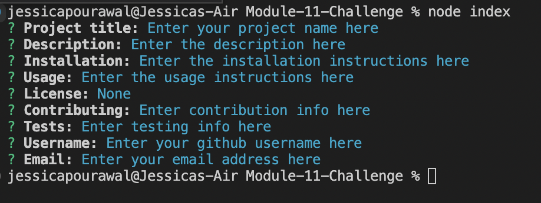

# Read me generator

[](https://opensource.org/licenses/ISC)

## Table of contents

- [Description](#description)
- [Installation](#installation)
- [Usage](#usage)
- [License](#license)
- [Contributing](#contributing)
- [Tests](#tests)
- [Questions](#auestions)

## Description

A node command-line application that generates a readme file based on user inputs.

## Installation

Run the following commands in an empty folder:

```
git clone "https://github.com/jkp1990/Module-11-Professional-README-Generator"
npm install
```

## Usage

Run the following command and answer the prompts.

```
node index
```



## License

This project is covered by the MIT license.

## Contributing

Clone the repo and create your own branch

## Questions

### Who is the original creator of this project?

jkp1990
[Link to profile](https://github.com/jkp1990)

### How can I contact them?

Send an email to jessicapourawal@gmail.com
